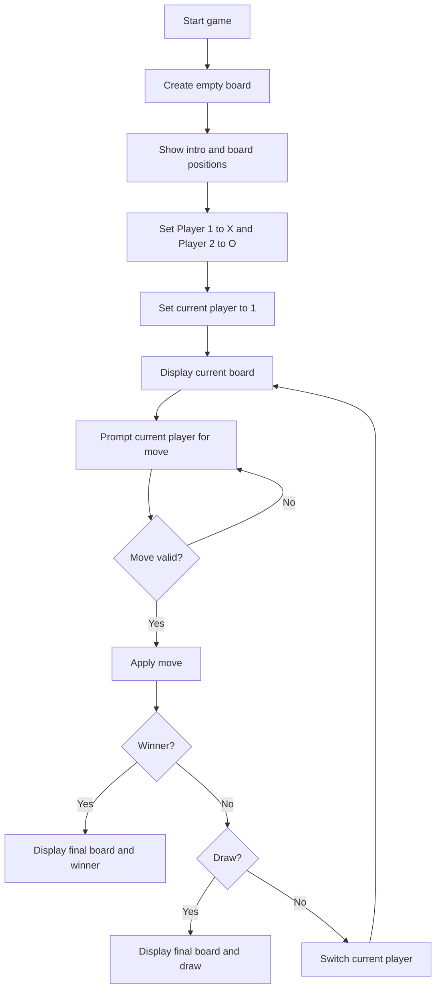
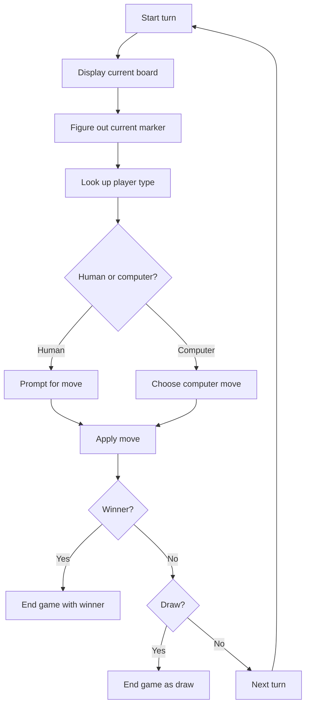

# Plan

## What RC likely cares about

- Can you explain code clearly?
- Can you change code live without panicking?
- Can you take suggestions and reason out loud?
- Can you debug calmly?

This project should optimize for readability, not cleverness.

## Implementation Plan

1. Keep the board as a flat list of 9 cells.
2. Put pure game logic in `game.py`.
3. Keep input and game loop in `main.py`.
4. Finish the two-human version first.
5. Test normal flow manually:
   - valid moves
   - invalid input
   - repeated square
   - win
   - draw

## Current Game Pseudocode

Use this to explain the code that already exists:

```text
start game:
    create empty board
    show intro and board positions
    set Player 1 to X
    set Player 2 to O
    set current player to 1

repeat until game ends:
    display current board
    ask current player for a move
        if input is not a number from 1 to 9:
            ask again
        if square is already taken:
            ask again

    place current player's marker on board

    if there is a winner:
        display final board
        announce winner
        stop

    if board is full and nobody won:
        display final board
        announce draw
        stop

    switch current player
```

And the game rules module:

```text
game.py helpers:
    create_board -> return 9 empty cells
    render_board -> turn board list into printable rows
    get_available_moves -> return indexes of empty cells
    is_valid_move -> check that a square is inside the board and empty
    apply_move -> place X or O in a square
    check_winner -> check all winning lines
    is_draw -> true when no winner and no moves left
```

## Current Game Flow Diagram



## Pairing Plan

Start by saying:

"I kept the game logic separate from the input loop so it would be easy to add a computer player during the interview, and the turn flow is driven by the current player instead of turn counting."

## Bot Pseudocode

Use this to explain the change before coding:

```text
Player 1 stays X
Player 2 becomes the computer as O
current player starts as 1

for each turn:
    show the board

    if current player is 1:
        ask for input
        validate the move
    else:
        get available moves
        choose one move

    apply the move

    if someone won:
        end game

    if board is full:
        end game as draw

    go to next turn
```

Then say how you would improve it if there is time:

```text
computer move strategy:
    if computer has a winning move:
        take it
    else if opponent has a winning move next turn:
        block it
    else:
        choose a random valid move
```

## Bot Flow Diagram



You can view Mermaid diagrams on GitHub and in many Markdown editors.

Then implement in this order:

1. Keep Player 1 as `X` and Player 2 as `O`.
2. Turn Player 2 into the computer.
3. Add `get_computer_move(board)` using a random available move.
4. Route move selection from `current_player`.
5. If time remains, improve the AI by checking:
   - winning moves first
   - blocking moves second

## Nice properties of this setup

- Easy to explain in under 2 minutes
- Small enough to modify comfortably
- Natural extension point for the interview task
- No framework overhead
